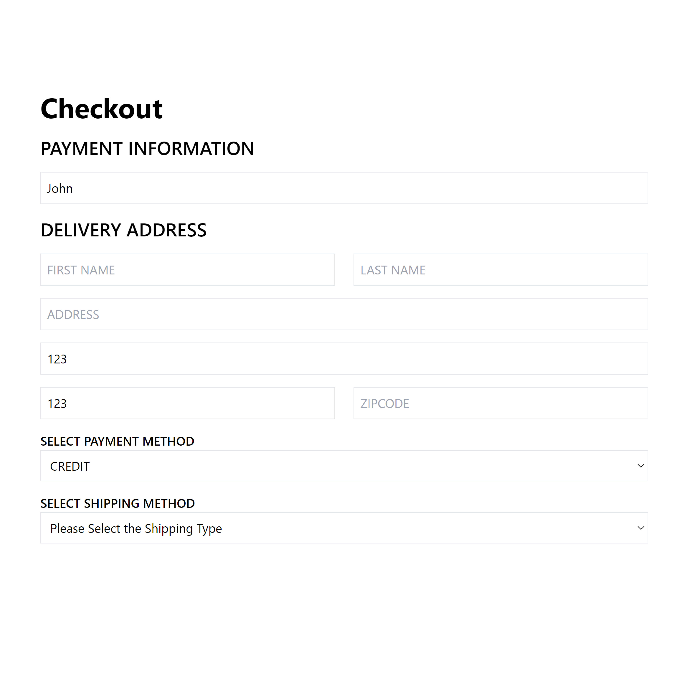
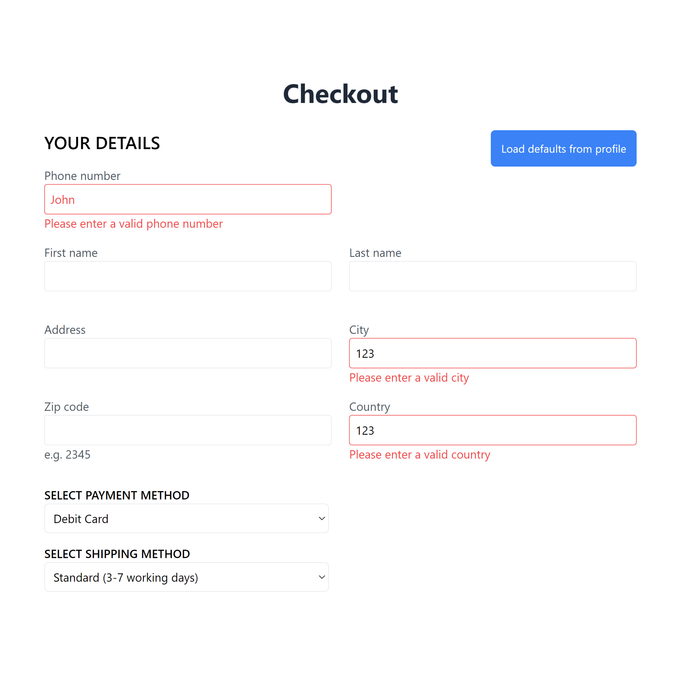

  

<h1 align="center" style="font-size: 5rem;">
Boba Business Management
</h1>

### Some quick context
Boba Business Management is an overhauled version of Boba Buddies Store, which was a group project we made together as a team of four. 
You can view the repository of Boba Buddies Store [here.](https://github.com/Boba-Buddies/boba-buddies-store)

After we finished Boba Buddies Store, I had to take a 6 month hiatus from coding. When I came back, I needed some coding practise to refresh my knowledge of web development.
We never ended up deploying Boba Buddies Store to the web, so I thought why not make a live version of it?

With that, I got to work!

## What does this app do?
- This app features two modes the user can switch between: **Shopper** and **Admin.**
- Everything you do as a shopper is reflected in the admin mode. And everything you do as an admin is reflected in the shopper mode.

### Shopper mode features:
- Search, filter, and sort for products you'd like to buy.
- Add products to your cart, modify quantities, choose your shipping method, and checkout with your delivery information.
- Create a wishlist of products you'd like to buy.
- Review and rate products.
- Fill out a contact form to send a message to the admins.
- Access your profile page:
    - View past orders.
    - Delete reviews you've made.
    - Edit your default address and personal details.

### Admin mode features:
- See daily notifications on the dashboard of new reviews, orders, messages, and products that need restocking.
- Access the reviews page:
    - Search, filter, and sort product reviews.
    - Moderate reviews with an option to disable their visibility to shoppers (e.g. if the review contains offensive material)
- Access the inbox page:
    - Search, filter, and sort user messages.
    - Delete messages.
- Access the orders page:
    - Search, filter, and sort user orders.
    - View full details of each order, e.g. total cost w/ shipping, delivery and contact information
- Access the products page:
    - Search, filter, and sort your store's products.
    - Edit any product's details, e.g. name, stock, price, description, and product image.
    - Enable/disable visiblity of a product to shoppers
    - View a product's reviews and rating metrics.

# What are the differences between Boba Business Management and Boba Buddies Store?

Boba Business Management introduces numerous new features, quality of life improvements, and optimizations that enhance usability and functionality, that were previously not in Boba Buddies Store. Below is a breakdown of these new features and changes compared to the previous version.

### New Features

- **Daily Generated Orders/Reviews/Messages**
  - Every day you log in as an admin, you will see newly generated orders, reviews, and messages. This feature reinforces the idea of managing a business dynamically. In the previous app, this wasn't a feature. 
  - Now, each order reduces the stock of the items in that order, requiring you to restock regularly. If a product is out of stock, new orders for it won't be processed, resulting in lost customers. 
  - Daily reviews from users directly impact product ratings, and as an admin, you must moderate these reviews as they come in on a daily basis. Irrelevant or offensive reviews need to be disabled to maintain a positive shopping experience.

- **Stock Management and Order Impact**
  - Orders now actually reduce the stock of the items purchased. In the previous version, orders had no effect on stock levels, causing inconsistencies in inventory management. 
  - When a product's stock falls below a certain threshold, it is tagged as "low stock" across the app, visible to shoppers. Customers are limited to purchasing the remaining quantity, and once the item is out of stock, the "add to cart" button is disabled with a message stating "out of stock."

- **Query Parameters for Filtering, Sorting, and Searching**
  - URLs now include query parameters that preserve filters, sorts, and searches even after refreshing or navigating to a new item and back. Previously, these parameters would be lost, causing a frustrating user experience. Imagine creating a custom search/filter/sort setup to view specific products, but upon viewing one and returning, all your settings are gone—this issue has been resolved.
  - Query parameters also retain the current page of your search results. Example URLs include:
    - `/shop?filter=without-pearls&sort=price-low-to-high&page=1`
    - `/admin/reviews?sort=oldest-first&filter=enabled&page=3`
    - `/admin/products-summary?filter=low-stock&page=2`
  - Searches entered in the search bar are cached into local storage. However, clicking the navigation link to the page directly resets the search/sort/filter as expected.
  - This new system has been implemented on the following pages: shop, admin orders table, admin reviews table, admin inbox, and admin product management page.

- **Shop Search Bar**
  - The shop page now has a search bar, allowing users to search for specific products they have in mind. In the previous version, there was no search bar, limiting user exploration and navigation within the store.

- **Form Validation Improvements**
  - Each form field is now specifically validated, ensuring that only appropriate data is entered. For example, a phone number cannot be entered into a name field, and names cannot be entered as zip codes. This provides clear, specific error messages for each field. Previously, any input could be entered in any field, and even empty fields could be submitted, leading to incomplete or incorrect data being stored.
  - This validation is implemented in various forms, each tailored to specific requirements: checkout form, edit profile form, modify product form, edit product form.

- **Custom 404 Page**
  - The app now features a friendly, informative custom 404 page that reads, "Sorry, we couldn't find that page," along with a button to redirect the user to the store. If in admin mode, the button redirects to the admin dashboard. Previously, there was only a generic "error" page with no helpful guidance or navigation options.

- **Slugs Instead of IDs for Product Pages**
  - URLs for product pages now use slugs instead of numeric IDs, making them more descriptive and user-friendly. For example, instead of `/shop/1`, the URL is now `/shop/pearl-milk-tea`. This provides more context and clarity when sharing URLs. In the older version, the lack of informative URLs resulted in a poor user experience.
  - The slug is auto-generated based on the product name and is automatically updated whenever the product name is changed by the admin.
  - To handle cases where a shopper navigates to a slug that no longer exists (e.g., if the admin updates the slug), a cache of old slug names is maintained. Each old slug is associated with its original ID, allowing seamless redirection from an outdated slug to the correct product page.
  - Additionally, if a user enters the numeric ID instead of the slug (e.g., `/shop/1`), logic is in place to find the associated slug and redirect them automatically to the slug URL (e.g., `/shop/pearl-milk-tea`).

- **Rating System Upgrade**:
  - The product rating system now uses a 'staring' system with half-star increments, providing a more intuitive experience for users. Previously, the ratings were set with a '+' and a '-' button, each increasing/decreasing the review by 0.5. Upon doing user testing, many were confused with the old rating system.
  - Also, the product page's reviews section now supports scrolling within the reviews container. In the older version, each review would add to the total length of the page. So, if there are too many reviews, the shopper would have to endlessly scroll down the page itself. This could lead to a bad user experience if they, for example, wanted to access the footer of the page.
 
- **Auto-Sorting for Daily Orders**
  - When navigating from the dashboard that shows the daily orders notification, the orders are automatically set to display in "newest-first" order. This improvement is made possible by the new query parameters setting, which allows links to be hard-coded with specific parameters, such as `/admin/orders?sort=newest-first&page=1`. 
  - In the previous version, the user would have to manually sort and search for the newest orders upon reaching the page, resulting in a less efficient user experience. Now, users can immediately see the most recent daily orders without extra steps.

# New UI

star rating system
The new UI changes how the rating system works when user is making a review. As mentioned before, it uses a traditional staring system one would expect to see, instead of the '+' '-' buttons.
[Insert image comparison]

order popup
[Insert image comparison]

review popup
[Insert image comparison]

email popup
[Insert image comparison]

edit product
[Insert image comparison]

cart
[Insert GIF comparison]

checkout
[Insert image comparison]

# Checkout page : Before and After

  
  

order history
[Insert image comparison]

user review in profile
[Insert image comparison]

disabled message for your own review

